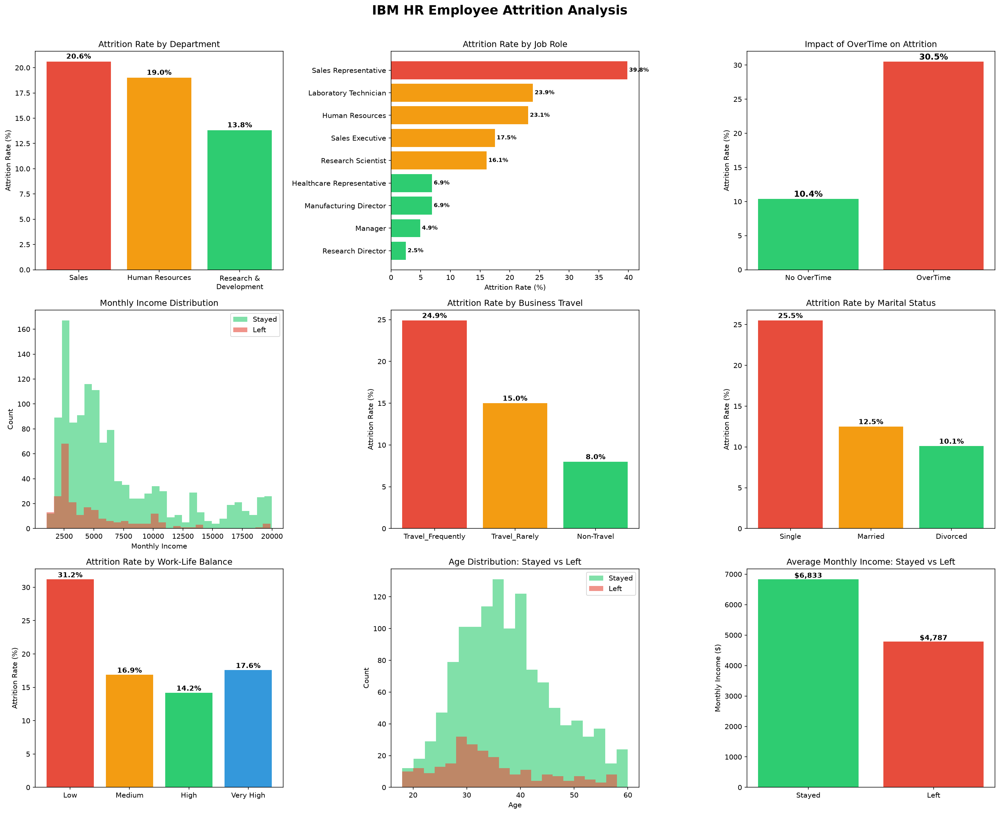

# HR Employee Attrition Analysis

Exploratory data analysis of 1,470 IBM employees to identify key drivers of attrition (16.1% overall rate), built with Python and Pandas.

## Objective
Identify which employee segments are most at risk of leaving, and provide actionable HR recommendations to improve retention.

## Key Insights
- **OverTime is the strongest driver:** employees doing overtime churn at 30.5% vs 10.4% without — 3x higher risk.
- **Compensation gap:** employees who left earned $2,046/month less than those who stayed.
- **Sales Representatives** have the highest attrition rate at 39.8%.
- **Frequent business travelers** churn at 24.9% vs 8.0% for non-travelers.
- **Poor work-life balance** leads to 31.2% attrition vs 14.2% for good balance.
- **Younger employees leave earlier:** average age 33.6 vs 37.6 for those who stayed.

## Business Recommendations
- Reduce mandatory overtime especially in Sales and Lab roles.
- Review compensation for high-risk roles.
- Introduce flexible travel policies for frequent travelers.
- Create early career development paths to retain junior employees.

## Tools & Skills
- Python, Pandas (data cleaning & analysis)
- Matplotlib (data visualization)
- Feature engineering, group analysis, attrition rate calculation

## Process
1. **Data Import** — loaded 1,470 employee records across 35 columns.
2. **Data Cleaning** — removed constant columns, added satisfaction labels, saved clean dataset separately.
3. **Exploratory Analysis** — calculated attrition rates by department, role, overtime, travel, income, and demographics.
4. **Visualization** — nine-panel dashboard highlighting all key attrition drivers.
5. **Report** — written summary of findings and recommendations.

## Visualizations

## Project Files
| File | Description |
|------|-------------|
| `hr_raw.csv` | Original dataset (unmodified) |
| `hr_clean.csv` | Cleaned and enriched dataset |
| `hr_analysis.ipynb` | Full analysis notebook |
| `hr_attrition_analysis.png` | Nine-panel visualization dashboard |
| `hr_attrition_report.txt` | Written findings and recommendations |
